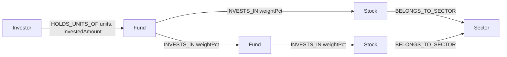
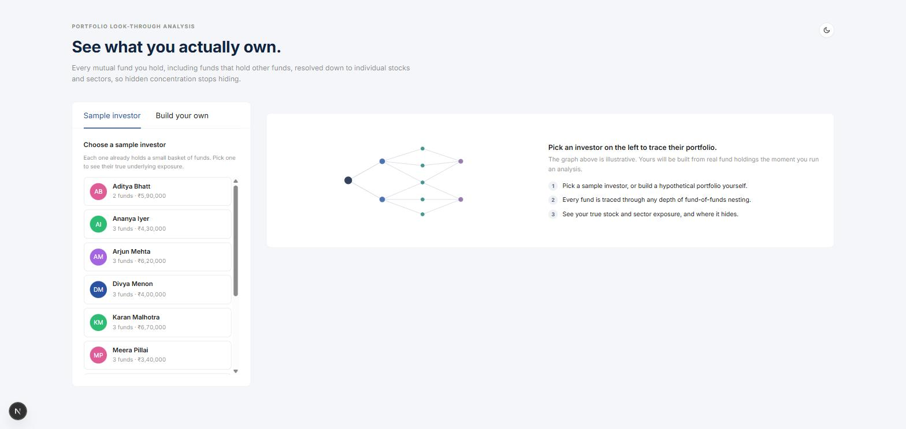
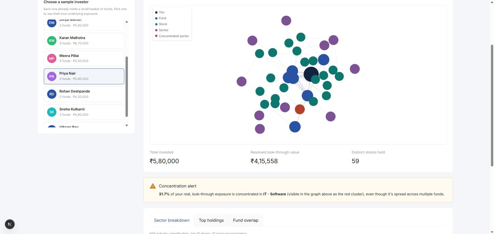
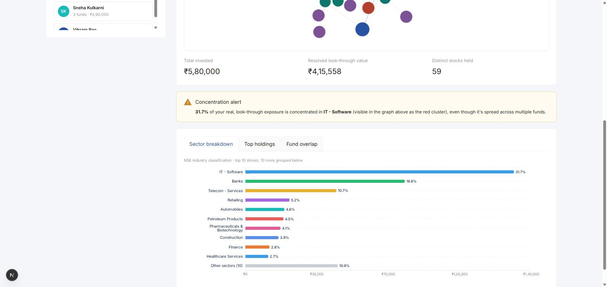
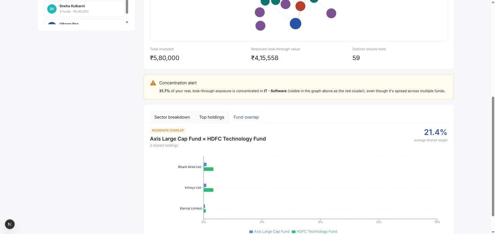
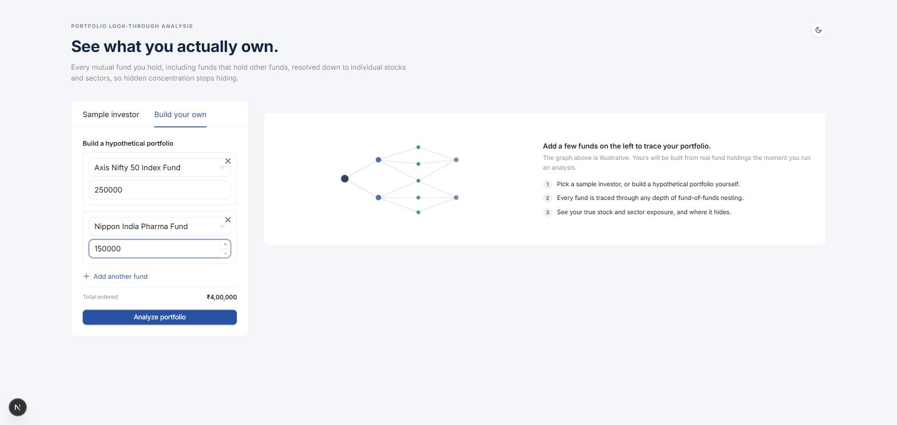
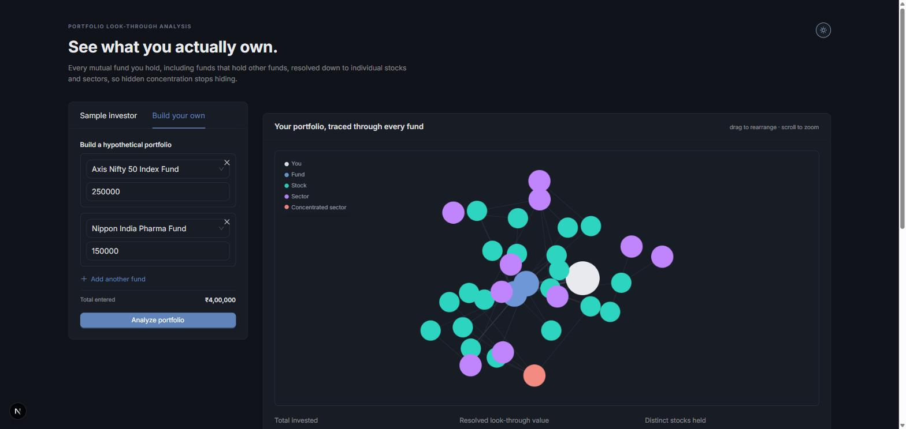

# Portfolio Look-Through

See what you actually own once every mutual fund you hold, including funds that hold *other*
funds, is resolved down to individual stocks and sectors. Built on
[CognoDB](https://console.cognodb.com), a managed graph database.

**Live demo:** [cognodb-portfolio-analyzer.vercel.app](https://cognodb-portfolio-analyzer.vercel.app)
**Screen recording:** _add link here_

---

## The problem

An investor who holds five "diversified" mutual funds usually has no idea what they actually
own, for two reasons:

1. **Overlap.** Different funds often hold the same large-cap stocks, so a portfolio that looks
   spread across five funds can secretly be concentrated in a handful of companies.
2. **Fund-of-funds.** Some funds don't hold stocks directly at all — they hold *units of other
   funds*, which may themselves hold units of other funds. The investor's real exposure is
   buried two or three layers down.

There's no way to answer "what do I actually own, and how concentrated am I?" without
resolving every fund's holdings recursively, through however many layers of nesting exist.
This is a real, named practice in the industry — Morningstar's "Portfolio X-Ray" feature does
exactly this.

This app builds that: pick a sample investor (or build a hypothetical portfolio), and see the
true look-through exposure, visualized as the actual traversal graph, broken down by stock and
by sector.

## Why a graph database?

- **Look-through exposure is a variable-depth traversal.** A fund can hold stocks directly, or
  hold another fund, which holds another fund, and so on — the nesting depth isn't known ahead
  of time. In SQL this needs a recursive CTE that re-joins the same tables at unknown depth
  while multiplying weights at each level. In Cypher it's a single variable-length path query
  (`-[:INVESTS_IN*1..5]->`) with `reduce()` to accumulate the weight along the path.
- **Fund overlap is a graph pattern, not a multi-way join.** "Which stocks do Fund A and Fund B
  both hold, and how much combined weight?" is a 2-hop pattern match
  (`(f1)-[r1]->(stock)<-[r2]-(f2)`), not a self-join across a holdings table.
- **The relationships carry meaning.** `weightPct` on `INVESTS_IN`, `investedAmount` on
  `HOLDS_UNITS_OF` — these are first-class properties on the edges themselves, which is exactly
  how a graph database models "how much of A is really B."

Both the look-through query and the overlap query are things a relational schema can express,
but only awkwardly (unbounded recursive joins, or self-joins that don't generalize past a fixed
number of hops). In Cypher they're both under 10 lines.

## Data model



**Nodes**

| Label | Properties |
|---|---|
| `Investor` | `name` |
| `Fund` | `code`, `name`, `category` |
| `Stock` | `ticker` (holds the real ISIN), `name` |
| `Sector` | `name` (real NSE industry classification) |

**Relationships**

| Type | From → To | Properties |
|---|---|---|
| `HOLDS_UNITS_OF` | `Investor → Fund` | `units`, `investedAmount` |
| `INVESTS_IN` | `Fund → Stock` or `Fund → Fund` | `weightPct` |
| `BELONGS_TO_SECTOR` | `Stock → Sector` | — |

`INVESTS_IN` is deliberately the same relationship type whether the target is a stock or
another fund — that's what makes the look-through query a single variable-length traversal
instead of two separate query paths.

## Data: real, with one synthetic layer

Direct fund holdings are **real**: pulled from AMFI mutual fund portfolio disclosures (via a
public data API) for 17 real Indian mutual fund schemes, trimmed to each fund's top 15 holdings
by weight — matching standard factsheet disclosure depth. That gives real ISINs, real company
names, real NSE sector classifications, and real weights. See `src/seed/data.js` for the full
dataset and its provenance notes.

**One layer is synthetic by necessity, not by convenience:** real AMFI disclosures report
fund-of-fund schemes already flattened to their underlying equities — the fund-holds-fund
structure isn't present in the source data at all. So 3 fund-of-funds wrappers (one nested two
layers deep) are synthesized on top of the real funds, purely to demonstrate the recursive
traversal that's the actual reason this app is built on a graph database. The 10 sample
investors are synthetic too, deliberately holding fund combinations that look diversified by
count but reveal real concentration once resolved.

Seeded dataset: 37 sectors, 132 stocks, 20 funds (17 real + 3 synthetic fund-of-funds), 10
sample investors.

## Tech stack

- **Database:** CognoDB (openCypher over Bolt), accessed via the official `neo4j-driver`.
- **App:** Next.js — a single codebase and single deployment, with API routes calling the
  database driver server-side. Chosen over a split Express API + separate frontend to avoid two
  codebases, CORS configuration, and two hosting deployments.
- **UI:** Ant Design, themed with a custom light/dark token system (`src/lib/theme.js` +
  `useThemeTokens()`) rather than left on Ant's stock defaults.
- **Charts:** Recharts, for the sector breakdown and fund-overlap comparison bar charts.
- **Graph visualization:** `react-force-graph-2d`, rendering the actual
  Investor → Fund → Stock → Sector traversal as an interactive node-link diagram — the
  concentrated sector's nodes render in a distinct color, directly visible as a cluster.

## Project structure

```
wexa-ai/
  src/
    app/                        # Next.js pages, layout, API routes
      api/
        funds/route.js
        investors/route.js
        investors/[name]/route.js
        analyze/route.js          # also assembles the graph payload for the visualization
      page.jsx                    # main UI
      layout.jsx
      globals.css
    lib/
      driver.js                   # neo4j driver singleton, reads env vars
      queries.js                    # parameterized Cypher, one function per query
      format.js                     # currency/percent formatting
      theme.js                      # light/dark colour tokens
      useThemeTokens.js               # theme context hook
    components/
      InvestorPicker.jsx           # sample-investor card list
      PortfolioBuilder.jsx           # hypothetical-portfolio fund/amount entry
      ExposureResults.jsx              # results shell: graph, stats, tabs
      PortfolioGraph.jsx                 # the interactive node-link graph
      FundOverlapTab.jsx                   # fund overlap pair comparison
      EmptyStatePreview.jsx                  # illustrated empty state
      ThemeProvider.jsx                        # theme state + Ant Design ConfigProvider
    seed/
      data.js                     # dataset: real fund holdings + synthetic FoF/investors
      seed.js                       # loads data.js into CognoDB
      test-queries.js                 # sanity-checks queries.js against seeded data
  test-connection.js            # minimal pre-seed connectivity smoke test
```

## Setup & run

### 1. Create a CognoDB instance

1. Sign up at [console.cognodb.com/signup](https://console.cognodb.com/signup) (free tier, no
   card required).
2. Create a free (c0) instance and pick a region — provisions in under a minute.
3. Copy the connection URI (`bolt+s://<instance-id>.databases.cognodb.cloud`) and the
   generated password for the `cognodb` user — **the password is shown only once**.

### 2. Configure environment variables

Create a `.env` file in the project root (never committed):

```
COGNODB_URI=bolt+s://<your-instance-id>.databases.cognodb.cloud
COGNODB_USER=cognodb
COGNODB_PASSWORD=<your-password>
```

### 3. Install, seed, and run

```bash
npm install
npm run seed   # loads the dataset (real fund holdings + synthetic FoF layer) into CognoDB
npm run dev    # starts the app at http://localhost:3000
```

### 4. (Optional) Sanity-check the queries directly

```bash
node src/seed/test-queries.js
```

## The core queries

All queries live in `src/lib/queries.js` and are called with parameters only — no string
concatenation into Cypher anywhere in the codebase.

### Look-through stock exposure (multi-hop, the anchor query)

```cypher
UNWIND $holdings AS h
MATCH (f0:Fund {code: h.fundCode})
MATCH p = (f0)-[:INVESTS_IN*1..5]->(stock:Stock)
WITH h, stock, reduce(w = 1.0, rel IN relationships(p) | w * (rel.weightPct / 100.0)) AS pathWeight
WITH stock, sum(h.investedAmount * pathWeight) AS exposureAmount
RETURN stock.ticker AS ticker, stock.name AS name, exposureAmount
ORDER BY exposureAmount DESC
```

For each fund an investor holds, this walks every `INVESTS_IN` chain — through any depth of
fund-of-funds nesting — down to the underlying stocks, multiplying the weight at each hop and
scaling by the amount invested. Multiple distinct paths to the same stock (e.g. a fund reachable
both directly and through a fund-of-funds) are summed correctly because every matched path
contributes its own weighted amount.

### Sector concentration

Same traversal, aggregated one hop further via `BELONGS_TO_SECTOR` — this is what powers the
"X% of your real exposure is in sector Y" alert.

### Fund overlap (2-hop, the SQL-awkward query)

```cypher
MATCH (f1:Fund {code: $fundCode1})-[r1:INVESTS_IN]->(stock:Stock)<-[r2:INVESTS_IN]-(f2:Fund {code: $fundCode2})
RETURN stock.ticker AS ticker, stock.name AS name, r1.weightPct AS fund1Weight, r2.weightPct AS fund2Weight
ORDER BY (r1.weightPct + r2.weightPct) DESC
```

Finds every stock two funds both hold directly, with each fund's weight — a pattern match, not
a multi-way join against a holdings table.

### Top holdings

The look-through query with a `LIMIT`.

### Similar funds

Ranks other funds by shared direct holdings with a given fund, using the same overlap pattern
aggregated across all funds instead of just two.

### Fund network (powers the graph visualization)

```cypher
UNWIND $fundCodes AS code
MATCH (f0:Fund {code: code})
MATCH p = (f0)-[:INVESTS_IN*1..5]->(:Stock)
UNWIND relationships(p) AS rel
WITH DISTINCT startNode(rel) AS a, endNode(rel) AS b, rel.weightPct AS weightPct
RETURN labels(a)[0] AS aLabel, coalesce(a.code, a.ticker) AS aId, a.name AS aName,
       labels(b)[0] AS bLabel, coalesce(b.code, b.ticker) AS bId, b.name AS bName,
       weightPct
```

Returns the deduplicated set of `Fund → Fund` and `Fund → Stock` edges reachable from a set of
held funds (plus a companion query for `Stock → Sector` edges). This is the raw subgraph the
frontend renders as the interactive node-link graph — a different shape of query than the
aggregation queries above, since it needs edges, not summed values.

## Engineering notes

- **Secrets:** read from environment variables (`COGNODB_URI`, `COGNODB_USER`,
  `COGNODB_PASSWORD`) via `src/lib/driver.js`; `.env` is gitignored.
- **Error handling:** every API route wraps its database calls in try/catch and returns a
  `503` with a plain-language message on failure; the UI renders a dedicated error state
  (with retry, where applicable) rather than crashing.
- **Driver lifecycle:** the Neo4j driver is a module-level singleton, instantiated once rather
  than per-request, to avoid exhausting CognoDB's free-tier connection limit.
- **Theming:** every colour in the UI is a named token in `src/lib/theme.js` (light and dark
  palettes), consumed via a `useThemeTokens()` hook backed by React context. The same tokens
  feed Ant Design's own `ConfigProvider`, so built-in components theme themselves too, not just
  the custom ones.

## Screenshots

_Screenshots below reflect the current UI — graph-first results view, card-based tabs, and the
light/dark theme toggle._

**Empty state**


**Sample investor analysis — the look-through graph and concentration alert**


**Sector breakdown**


**Fund overlap comparison**


**Building a custom hypothetical portfolio**


**Dark mode**

